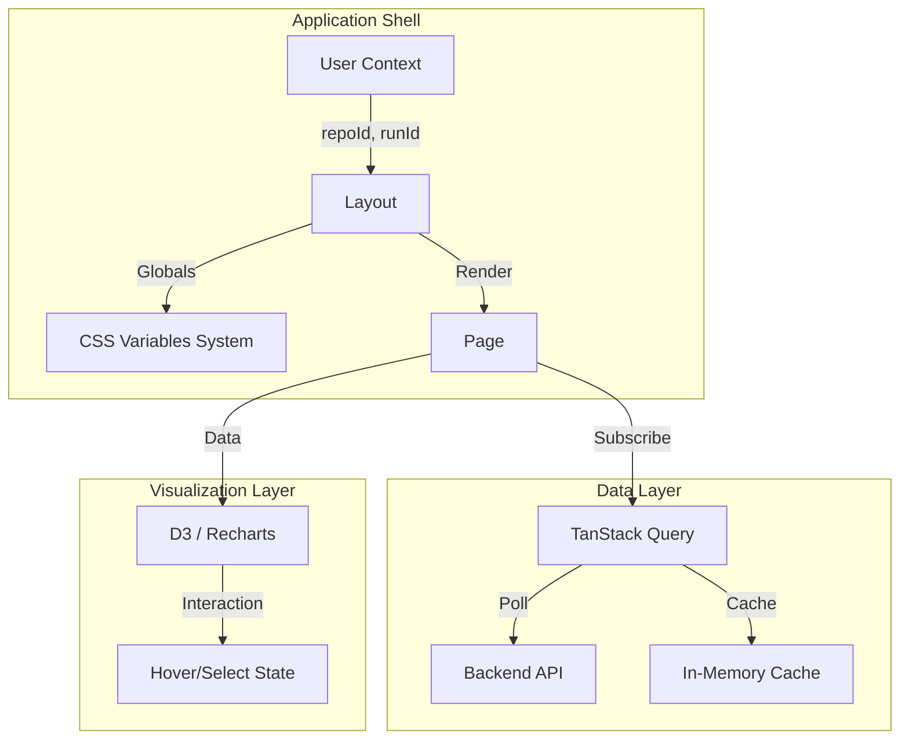

# 🏗️ Client Architecture

This document serves as the technical manual for the Code Archaeology frontend. It details the design decisions, state management strategies, and architectural patterns used to visualize complex Git history data.

---

## 📐 High-Level Design

The frontend follows a **Distributed State Architecture**:
1.  **URL as Source of Truth**: Route parameters drive the view (e.g., `/hotspots` vs `/timeline`).
2.  **Server State (React Query)**: Caches API responses and handles polling for analysis status.
3.  **Client State (Context)**: Manages session-persistent data like the currently selected `repoId`.
4.  **Visual State (Local)**: Charts manage their own interaction state (hover, zoom) to maintain 60fps performance.



---

## 🔧 Core Systems

### 1. State Machine & Polling (`lib/useAnalysisRun.ts`)
The application needs to track the lifecycle of a long-running backend analysis. We implement a **Smart Polling** strategy:

-   **Idle**: No `runId` present.
-   **Queued/Running**: Polls `/api/analysis/:id` every 3000ms.
-   **Succeeded/Failed**: Polling stops automatically.
-   **RefetchInterval Logic**:
    ```typescript
    // Adaptive polling: stop immediately when done
    refetchInterval: (query) => {
      const status = query.state.data?.status;
      return (status === "succeeded" || status === "failed") ? false : 3000;
    }
    ```

### 2. "No-Tailwind" Semantic Styling (`globals.css`)
We use a **Layered CSS Architecture** instead of atomic utility classes to maintain cleaner markup in complex visualization components.

-   **Layer 1: Semantic Variables**
    -   Defined in `:root`.
    -   Examples: `--signal` (Success/Green), `--risk` (Danger/Red), `--panel-soft` (Card backgrounds).
    -   *Why?* Allows instant theming changes and consistent color usage across D3 charts and UI.

-   **Layer 2: Component Classes**
    -   `.soft-panel`: Glassmorphic card style with backdrop blur.
    -   `.stat-card`: Standardized metric container.
    -   *Why?* Reduces JSX clutter (`className="stat-card"` vs `className="p-4 bg-slate-900 border..."`).

### 3. Visualization Engine

The app uses a hybrid approach for charts:

#### A. D3.js (e.g., `TreemapChart.tsx`)
Used when we need **complex algorithmic layouts** that Recharts doesn't support.
-   **Squarified Treemap**: We use `d3.treemap` with `treemapSquarify` tiling for the Hotspots view.
-   **DOM Integration**: We let D3 calculate the math (`x0`, `y0`, `width`, `height`) but let **React render the SVG elements**.
-   *Benefit*: React handles the DOM reconciliation (perfect for hover states/updates), D3 handles the heavy geometry math.

#### B. Recharts (e.g., `TimelineChart.tsx`)
Used for **standard time-series visualizations**.
-   **Composability**: Built using `<LineChart>`, `<XAxis>`, `<Tooltip>`.
-   **Customization**: We inject our Semantic CSS variables into the chart colors so the charts match the UI theme perfectly.

---

## 📂 Directory Structure

```
client/src/
├── app/                        # Next.js App Router (File-system routing)
│   ├── (dashboard)/            # Authenticated layout group
│   │   ├── layout.tsx          # Shell (Sidebar + Navbar)
│   │   ├── page.tsx            # Overview Dashboard
│   │   ├── [feature]/          # Feature routes (hotspots, timeline, etc.)
│   │   │   └── page.tsx        # Feature entry point
│   │   └── loading.tsx         # Streaming Suspense fallback
│   ├── globals.css             # Design System tokens
│   └── layout.tsx              # Root Provider Setup
├── components/
│   ├── charts/                 # D3 & Recharts visualizations
│   │   ├── TreemapChart.tsx    # Custom D3 Hotspot visualization
│   │   └── TimelineChart.tsx   # Recharts Activity view
│   ├── DashboardNav.tsx        # Global navigation & status indicator
│   └── QueryProvider.tsx       # React Query client setup
├── lib/
│   ├── api.ts                  # Type-safe Fetch wrapper with error handling
│   ├── analysisStorage.ts      # LocalStorage persistence logic
│   ├── hook/                   # Business logic hooks
│   │   ├── useAnalysisRun.ts   # Polling state machine
│   │   └── useAnalysisState.ts # Global session state
│   └── format.ts               # Data formatting utilities
```

## 🔐 API Layer (`lib/api.ts`)

A thin, type-safe wrapper around `fetch`:
-   **Error Handling**: Automatically parses JSON error responses and throws typed errors.
-   **Typing**: Generic `api<T>` function ensures components receive typed data.
-   **Defaults**: Injects `Content-Type: application/json` and `credentials: include` automatically.

## 🚀 Performance Considerations

1.  **Server Components**: We use Server Components for the initial shell to reduce First Contentful Paint (FCP).
2.  **Memoization**: Chart calculations in `TreemapChart.tsx` are wrapped in `useMemo` to prevent expensive d3 recursions on simple re-renders.
3.  **Lazy Data**: Feature routes only fetch data when visited (automatic code splitting via Next.js).
